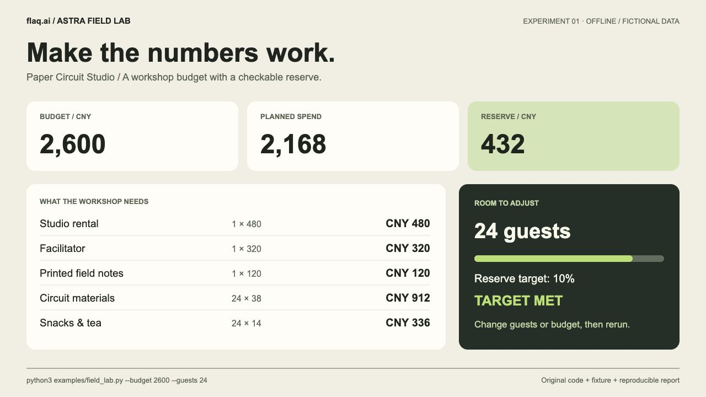
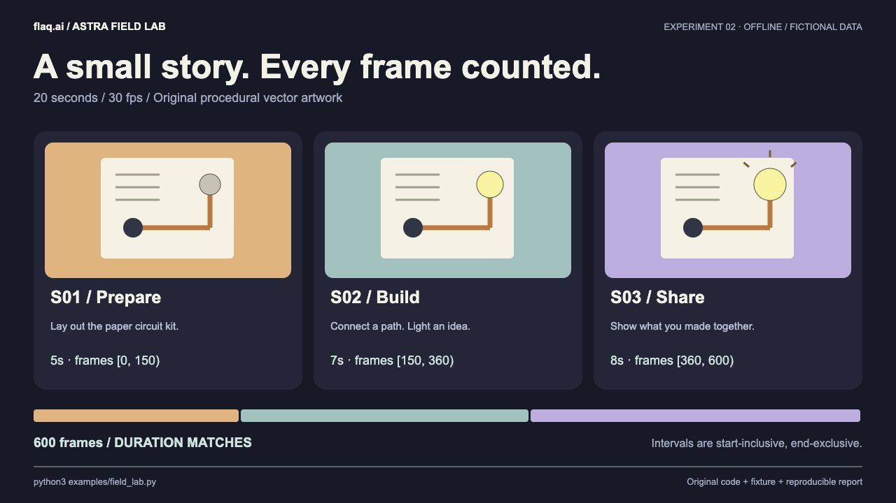
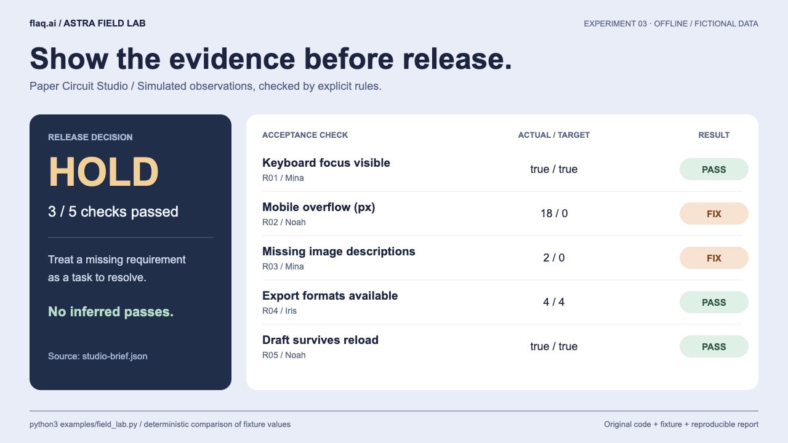

# GPT-6 Astra 실전 가이드

**[flaq.ai](https://flaq.ai/) 팀이 정리한 최신 GPT-6 Astra 가이드**입니다. 모델 소개, 시작 방법, 실행 가능한 코드, 제작 워크플로와 실제 스크린샷을 제공합니다.

<!-- languages:start -->
[English](README.md) · [简体中文](README_zh.md) · [繁體中文](README_tw.md) · [日本語](README_ja.md) · **한국어** · [Español](README_es.md) · [Français](README_fr.md) · [Deutsch](README_de.md) · [Português](README_pt.md) · [Русский](README_ru.md) · [Bahasa Indonesia](README_id.md) · [العربية](README_ar.md)
<!-- languages:end -->

최종 확인: 2026-09-08. OpenAI 공식 문서가 아닌 독립적인 팀 가이드입니다. README는 12개 언어를 지원하며, 상세 튜토리얼과 예제 진단 메시지는 현재 중국어 간체로 제공됩니다.

[시작 안내](docs/quickstart.md) · [사례 12개](docs/cases.md) · [워크플로 6개](docs/workflows.md) · [코드 예제](examples/README.md)

## Astra 소개

Astra는 복잡한 추론, 코딩, 조사와 여러 단계의 작업을 위한 OpenAI 모델입니다. 텍스트와 이미지를 입력받고 텍스트를 출력합니다. 브라우저 조작, 프로그램 실행, 영상 제작에는 실행 환경의 별도 도구가 필요합니다.


[공식 모델 문서](https://developers.openai.com/api/docs/models/gpt-6-astra) · [설정과 고급 기능](https://developers.openai.com/api/docs/guides/latest-model)

## 코드 없이 시작하기

이용 권한이 있는 제품에서 Astra를 선택하고 자료와 작은 목표를 전달하세요. 다음 요청으로 시작할 수 있습니다.

```text
카페의 이틀짜리 행사를 계획해 주세요. 예산은 2,000위안, 직원은 두 명입니다. 행사 규칙, 일정, 항목별 예산, 홍보 문구 세 개를 작성하고 합계와 가정을 확인해 주세요.
```

## 클라이언트에서 바로 사용

ChatGPT 계정으로 로그인하여 시작하며 API 키를 먼저 설정할 필요가 없습니다. Astra 접근과 한도는 계정 및 작업 공간에 따라 다릅니다.

### ChatGPT

ChatGPT에 로그인하고 결과물 제작에는 Work를 선택합니다. 모델/Power에서 Astra를 고르고 필요하면 Advanced에서 확인합니다. 예산 이미지를 첨부하고 24명과 32명을 비교해 달라고 요청합니다.

### Codex

Codex 클라이언트에 로그인합니다. 통합 데스크톱 앱에서는 Codex로 전환하고 로컬 프로젝트 폴더를 엽니다. 새 작업에서 Astra를 선택해 실습 실행, 파일과 실제 점검 결과를 요청합니다.

### Codex CLI

[CLI 설치](https://learn.chatgpt.com/docs/cli). 공식 페이지에서 CLI를 설치하고 프로젝트 폴더에서 시작합니다. 처음에는 Sign in with ChatGPT를 선택합니다. 세션 안에서 /model로 Astra를, /status로 설정을 확인한 후 일상 언어로 요청합니다.

```bash
codex -m gpt-6-astra
```

[자세한 단계(중국어)](docs/quickstart.md) · [English](README.md) · [Models](https://learn.chatgpt.com/docs/models)

<details>
<summary>API는 자체 앱에 통합할 때만</summary>

[API](docs/api.md) · [Python / JavaScript](examples/README.md)

</details>

## 독자적으로 만든 실습 실행

세 가지 자체 제작 실습은 하나의 가상 스튜디오 자료를 공유합니다. 이미지는 로컬에서 생성한 SVG 보고서의 실제 브라우저 캡처이며, 타인의 작품이나 Astra API 실측 결과가 아닙니다.

```bash
python3 examples/field_lab.py
# Alternative scenario / 独立输出目录
python3 examples/field_lab.py --guests 32 --out outputs/field-lab-32
```



예산: 지출 2,168위안, 예비비 432위안.



스토리보드: 20초, 30 fps, 연속된 600프레임.



출시 검토: 가상 점검 5개 중 3개 통과, 2개 수정 필요.

[소스 코드, 재현 방법, 연습](docs/original-lab.md) · [SVG / PNG](assets/screenshots/README.md)

## 실전 워크플로

가장 작은 작동 버전부터 만들고 실제 화면과 오류를 바탕으로 개선하세요. 편집 가능한 파일, 실행 방법, 실제 스크린샷을 결과물에 포함하도록 요청하세요.

[워크플로 6개](docs/workflows.md)

## 검증과 기여

오프라인 테스트 28개를 통과했습니다. 유료 API 호출과 전체 커뮤니티 작품의 재현 검증은 하지 않았습니다. [검증 기록](docs/verification.md) · [출처](docs/sources.md) · [기여 안내](CONTRIBUTING.md). 자체 문서와 코드는 [MIT](LICENSE)를 따르며 타사 자료에는 각각의 권리가 적용됩니다.

## 재미있는 3D: 스스로 조립되는 로봇

탁상 로봇, 조립 애니메이션, 독서 공간, 종이 회로 단편, 버섯 캐릭터, 장면 점검 등 여섯 가지 실습을 추가했습니다. 영어·중국어 가이드에 프롬프트, 설정, 프레임 검사와 자체 스크립트가 있습니다. 스크립트는 문법만 확인했으며 Blender 실행은 검증하지 않았습니다.

[Blender 실습 가이드](docs/blender-playbook.md) · [Python](examples/blender/desk_robot.py)

## flaq.ai 소개

[flaq.ai](https://flaq.ai/)는 AI 에이전트와 운영 애플리케이션을 위한 이미지, 영상, 음악, 언어 모델 통합 API를 제공합니다. 팀은 이 가이드를 통해 실용적인 AI 활용 방법을 공유합니다. 오픈 소스 워크플로: [Backlink Skills](https://github.com/flaqai/backlink_skills).

## 제휴 마케팅 및 파트너 지원

크리에이터, 개발자, 교육자는 [Flaq.ai 제휴 프로그램](https://flaq.ai/affiliate-program/)에 참여해 자신의 추천 링크로 튜토리얼, 리뷰, 통합 가이드를 공유할 수 있습니다.

추천 사용자의 첫 유효 유료 주문은 **20%**, 이후 유효 유료 주문은 **10%**입니다. 주문 인정 기간은 추천 사용자가 가입한 후 **60일**입니다.

로그인 후 제휴 프로필을 작성하면 링크, 추천 내역, 지급 설정을 관리할 수 있습니다. 공유 시 제휴 관계를 명확히 밝히세요. 자격, 심사, 지급은 현행 [제휴 약관](https://flaq.ai/affiliate-agreement/)을 따르며 수익을 보장하지 않습니다.

## 참고 자료와 영감

[用GPT-6 Astra操控Blender玩3D，保姆级教程来了。](https://mp.weixin.qq.com/s/yK65CvMwzhQqu5_E5EfVVQ)

발행: 数字生命卡兹克. 저자: 卡兹克、可达. 2026-09-08. 작업 흐름의 참고 자료이며, 원문의 이미지나 긴 프롬프트는 재게시하지 않습니다.
