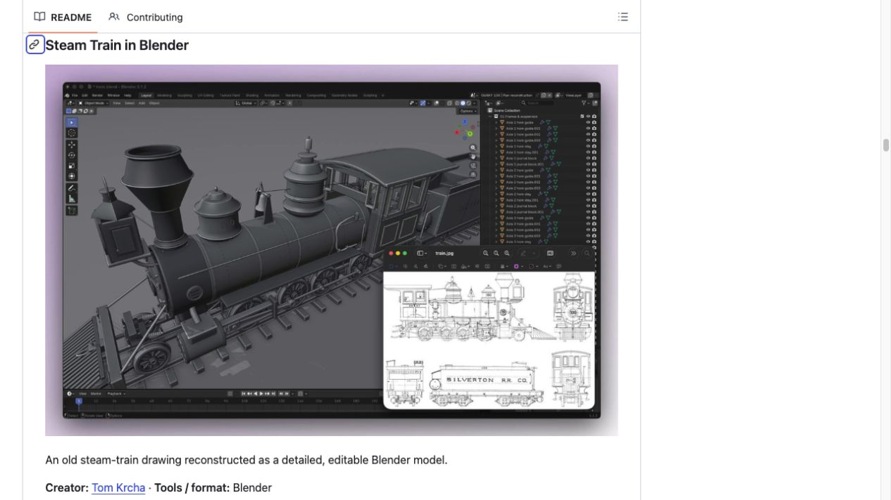
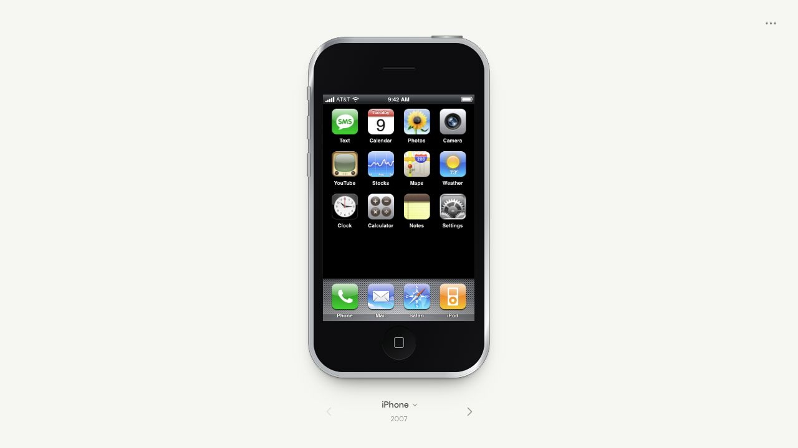
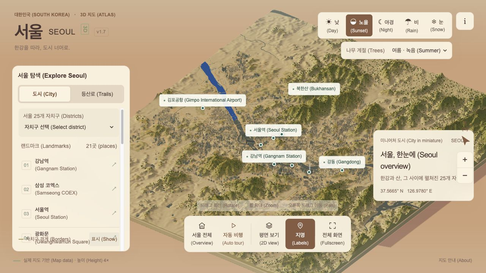

# 12 个值得上手的 Astra 案例

[中文首页](../README_zh.md) · [English](../README.md) · [实战工作流](workflows.md)

由 **[flaq.ai](https://flaq.ai/) 团队**精选 12 个案例，覆盖游戏、3D、网页、视频、绘图和科学可视化。通过原帖、作品入口与小版本练习，帮助读者从欣赏效果走向实际动手。

**阅读方式**：先看作品链接，再完成一个缩小版练习。下面所有“练习指令”和“验收”均由本指南编写，不是作者原始提示词。模型归因来自作者/目录说明；除了明确写出的页面检查，本仓库未独立复现作品。在线链接不等于永久可用，源码链接不等于自由商用。

| # | 案例 | 方向与难度 | 练习重点 |
| --- | --- | --- | --- |
| 01 | [果冻物理玩具](#case-01) | 游戏 · 中级 | 柔体交互 |
| 02 | [泡泡纸破坏实验](#case-02) | 游戏 · 中级 | 可破坏场景 |
| 03 | [浏览器角色扮演世界](#case-03) | 游戏 · 高级 | 场景与游戏流程 |
| 04 | [参考图变蒸汽火车](#case-04) | 3D · 中级 | 参考图建模 |
| 05 | [建筑场景与镜头](#case-05) | 3D · 高级 | 建筑与渲染 |
| 06 | [全息卡片](#case-06) | 3D · 中级 | 材质与视差 |
| 07 | [可交互的手机档案](#case-07) | 网页 · 入门 | 界面与状态 |
| 08 | [首尔三维地图](#case-08) | 网页 · 高级 | 数据与空间表达 |
| 09 | [机器人装配说明](#case-09) | 可视化 · 高级 | 现有 CAD 的交互展示 |
| 10 | [素材自动剪辑](#case-10) | 视频 · 中级 | 现有素材编排 |
| 11 | [像素画制作](#case-11) | 绘图 · 中级 | 可编辑像素作品 |
| 12 | [混沌轨迹探索](#case-12) | 科学可视化 · 高级 | 参数与模拟 |

<a id="case-01"></a>

## 01 · 果冻物理玩具

**Jelly Baby Playground** · 游戏 · 中级 · 作者：[Scott](https://x.com/scottstts)

[原帖](https://x.com/scottstts/status/2096364764054131119) · [在线作品](https://jelly.scottsun.io/) · [作者代码](https://github.com/scottstts/Jelly-Baby)

**核对范围**：作者提供源码；本次未运行，浏览器需支持其图形能力。

**从小版本开始**：

```text
先用一个球体做按住拖拽、松手弹回的玩具。显示操作说明、重置按钮；先用简化弹簧模型，再考虑复杂柔体。
```

**验收**：拖拽可释放，重置恢复初态，快速操作不会令物体消失。

**下一步**：[对应工作流](workflows.md#workflow-game)。

<a id="case-02"></a>

## 02 · 泡泡纸破坏实验

**Bubble Wrap Simulator** · 游戏 · 中级 · 作者：[FinkTheArtist](https://x.com/crtvTeknologist)

[原帖](https://x.com/crtvTeknologist/status/2096980188126986533) · [在线作品](https://bubble-wrap-simulator.vercel.app/) · [作者代码](https://github.com/finktheartist/bubble-wrap-simulator.git)

**核对范围**：作者提供源码；本次未运行或验证物理效果。

**从小版本开始**：

```text
做一面 10×10 的泡泡网格，点击破裂并计数；全部破裂后可重置。先让二维版本稳定，再增加三维视角。
```

**验收**：重复点同一格不会重复计分，重置后计数归零。

**下一步**：[对应工作流](workflows.md#workflow-game)。

<a id="case-03"></a>

## 03 · 浏览器角色扮演世界

**Elderwood Realms** · 游戏 · 高级 · 作者：[Rohan Varma](https://x.com/TheRohanVarma)

[原帖](https://x.com/TheRohanVarma/status/2096744577332068549) · [在线作品](https://elderwood-realms.rohannvarma.chatgpt.site/)

**核对范围**：有作者提供的演示链接；本次未验证多人游戏。

**从小版本开始**：

```text
做一个原创风格的单人小村庄：移动、与 NPC 对话、收集一件物品。交付一个可完成的小任务，再讨论联网。
```

**验收**：任务能完成；刷新后的存档规则清楚。

**下一步**：[对应工作流](workflows.md#workflow-game)。

<a id="case-04"></a>

## 04 · 参考图变蒸汽火车

**Steam Train in Blender** · 3D · 中级 · 作者：[Tom Krcha](https://x.com/tomkrcha)

[原帖](https://x.com/tomkrcha/status/2095756085890310311)



**核对范围**：已截取参考仓库内的作者预览；未拿到或运行模型工程。

**从小版本开始**：

```text
基于我提供的有权使用的车辆参考图，先用基本几何体搭出车身、驾驶室和轮组。分别命名，输出可编辑 .blend 和三视图。
```

**验收**：各部件可独立选中；比例与参考图可对照；文件可重新打开。

**下一步**：[对应工作流](workflows.md#workflow-3d)。

<a id="case-05"></a>

## 05 · 建筑场景与镜头

**Palace of Fine Arts** · 3D · 高级 · 作者：[Sharif Shameem](https://x.com/sharifshameem)

[原帖](https://x.com/sharifshameem/status/2095653641164329143)

**核对范围**：作者展示作品；本次未复现建模与渲染。

**从小版本开始**：

```text
用简化柱廊和穹顶制作原创建筑练习。先固定一个镜头与光照，渲染低分辨率检查图，检查通过后输出最终静帧。
```

**验收**：柱子排列规则一致；没有明显穿插；可从保存工程重渲染。

**下一步**：[对应工作流](workflows.md#workflow-3d)。

<a id="case-06"></a>

## 06 · 全息卡片

**Holographic 3D Cards** · 3D · 中级 · 作者：[EverettFish](https://x.com/everettfish0408)

[原帖](https://x.com/everettfish0408/status/2096765359282061544) · [作者代码](https://github.com/EverettFish/holo-card-studio)

**核对范围**：作者提供源码；本次未运行工作流。

**从小版本开始**：

```text
用我有权使用的插画制作一张卡片：前景与背景分层，鼠标移动产生轻微视差。提供减少动态效果的选项。
```

**验收**：文字可读；视差幅度受限；关闭动画后仍能看内容。

**下一步**：[对应工作流](workflows.md#workflow-web)。

<a id="case-07"></a>

## 07 · 可交互的手机档案

**Interactive iPhone History** · 网页 · 入门 · 作者：[bluedev](https://x.com/blueemi99)

[原帖](https://x.com/blueemi99/status/2096917792737911131) · [在线作品](https://iphone-archive.vercel.app/)



**核对范围**：已打开在线页面并截屏；未验证全部机型和应用功能。

**从小版本开始**：

```text
制作一个原创复古设备展示页，先做一种设备与三个模拟应用。支持打开应用和返回主页，说明这只是界面演示。
```

**验收**：应用打开和返回都可用；键盘能聚焦按钮；窄屏不溢出。

**下一步**：[对应工作流](workflows.md#workflow-web)。

<a id="case-08"></a>

## 08 · 首尔三维地图

**Seoul 3D Atlas** · 网页 · 高级 · 作者：[synabreu](https://x.com/synabreu)

[原帖](https://x.com/synabreu/status/2096557555086725159) · [在线作品](https://seoul-3d-atlas.synabreu.chatgpt.site/)



**核对范围**：已打开、切换 City 标签和 Sunset 模式并截屏；未核验地理精度。

**从小版本开始**：

```text
用合法来源的公开地理数据做一个小街区地图，只选三个地标。标明数据来源和估算项，支持点击定位及昼夜切换。
```

**验收**：三个地标可定位；模式切换可见；来源明确，估算高度有标识。

**下一步**：[对应工作流](workflows.md#workflow-web)。

<a id="case-09"></a>

## 09 · 机器人装配说明

**Microduck Assembly Lab** · 可视化 · 高级 · 作者：[yishan](https://x.com/tspy)

[原帖](https://x.com/tspy/status/2096238855519453662) · [在线作品](https://microduck-assembly-lab.yishan-lin.chatgpt.site/)

**核对范围**：作者展示的是已有设计的查看器；本次未运行，不据此声称模型设计了机器人。

**从小版本开始**：

```text
使用提供的模型文件制作装配查看器，首版只展示五个部件。点击部件高亮，显示名称与来自资料的装配顺序。
```

**验收**：标签与模型对应；重置视图有效；不把缺失的结构说明编出来。

**下一步**：[对应工作流](workflows.md#workflow-3d)。

<a id="case-10"></a>

## 10 · 素材自动剪辑

**Editing from 55 Video Clips** · 视频 · 中级 · 作者：[Tykoo](https://x.com/0xTykoo)

[原帖](https://x.com/0xTykoo/status/2096183262255386833)

**核对范围**：作者展示剪辑流程；本次未复现。素材由外部提供。

**从小版本开始**：

```text
从我提供的五段公开视频素材里剪一支 15 秒短片。先列时间码和选材原因，再加标题字幕。交付工程、素材清单和 MP4。
```

**验收**：长度符合目标；字幕不被裁切；素材可追溯；画面无意外黑帧。

**下一步**：[对应工作流](workflows.md#workflow-video)。

<a id="case-11"></a>

## 11 · 像素画制作

**Hatsune Miku Pixel Art** · 绘图 · 中级 · 作者：[すえまる](https://x.com/suemaruuuuuuX)

[原帖](https://x.com/suemaruuuuuuX/status/2096212351502721361)

**核对范围**：作者展示 Aseprite 作品；本次未操作 Aseprite 或验证制作过程。

**从小版本开始**：

```text
设计一个原创 32×32 像素机器人，限定八色，透明背景。提供可编辑图层与 PNG，按 1 倍和 8 倍显示检查。
```

**验收**：像素边缘没有模糊插值；颜色数符合限制；图层可编辑。

**准备环境**：Aseprite 或其他像素编辑器，以及可操作软件或导出文件的工具。Astra 的文字 API 本身不会替你启动绘图软件。

<a id="case-12"></a>

## 12 · 混沌轨迹探索

**Lorenz Chaos Explorer** · 科学可视化 · 高级 · 作者：[Juy | AI experiments](https://x.com/juyeam)

[原帖](https://x.com/juyeam/status/2096572156453028193) · [在线作品](https://tiny-worlds-juyeam.juyeam.chatgpt.site/chaos)

**核对范围**：作者提供演示；本次未运行数值验证。

**从小版本开始**：

```text
制作两组接近初值的 Lorenz 轨迹教学工具，公开方程、步长与积分方法；提供暂停与重置。用减半步长做短时间收敛检查。
```

**验收**：初值可修改；重置一致；区分数值误差与系统的敏感性，不宣称长期精确预测。

**下一步**：[对应工作流](workflows.md#workflow-research)。

## 怎么选择第一个案例

- **只有浏览器**：先试手机界面练习，减少外部依赖。
- **会一点前端**：试泡泡网格或卡片视差，再加 3D。
- **有 Blender 基础**：先做火车的粗模，检查比例后再加细节。
- **做内容创作**：先用五段素材完成一次可编辑剪辑，再扩大规模。

截图采集日期、来源和权利说明见 [截图清单](../assets/screenshots/README.md)。
